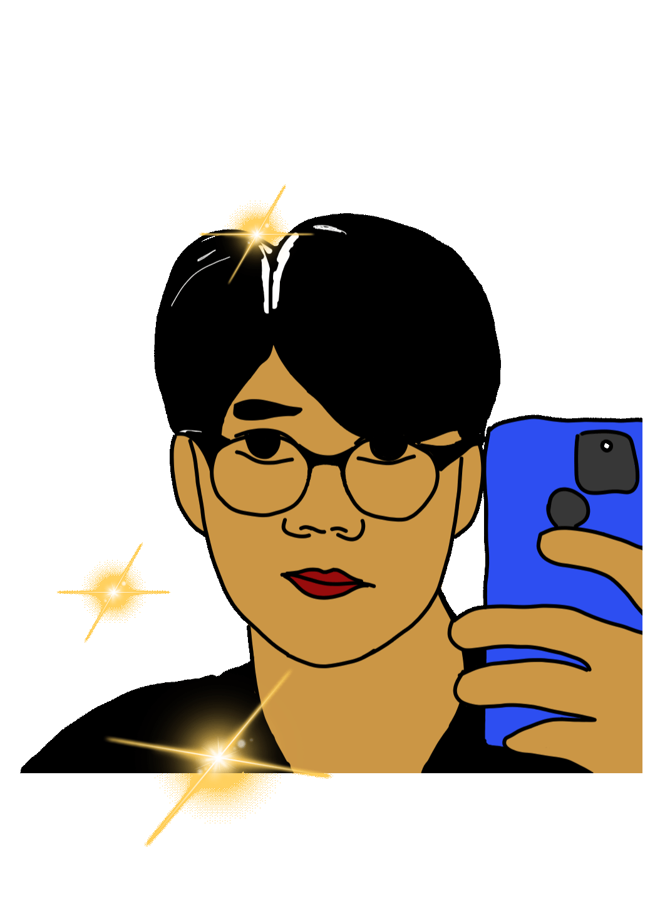

<h1 align="center"><samp>Hi there 👋🏾, welcome to my GitHub!</h1>
<h4 align="center"> 🎮 I'm a Game Developer - Nguyen Zuy.</h4>
<h4 align="center"> 🎨 I also enjoy 2D Art and am always 🧠 exploring new things 😈😈</h4>

  

  

    
    
    
  

---

<h2 align="center">💼 About Me</h2>

Experienced Game Developer with 2+ years in Unity, C#, and backend tech. Skilled in cross-platform optimization, AI integration, and team collaboration to deliver immersive games. Focused on mobile optimization and continuous innovation in game technology.

---

<h2 align="center">🎓 Education</h2>

  <b>Bachelor of Engineering in Information Technology</b> 
  Posts and Telecommunications Institute of Technology <b>(PTIT)</b> 
  Concentration: Software Engineering 
  Ho Chi Minh City, Vietnam 
  Graduated: December 2024

---

<h2 align="center">💻 Professional Experience</h2>

  <b>Game Developer</b> | QTS Australia 
  Ho Chi Minh City, Vietnam | August 2022-2025

---

<h2 align="center">🛠️ Technologies & Tools</h2>

  
<b>🎮 Game Development</b>

   
  

    
  

  
<b>💻 Languages & Frameworks</b>

   
  

    
  

  
<b>🗄️ Databases & DevOps</b>

   
  

    
  

  
<b>🔧 Tools & Platforms</b>

   
  

    
  

  
<b>🐧 Operating Systems</b>

   
  

    
  

---

<h2 align="center">📊 GitHub Stats</h2>

  

---

<h2 align="center">📫 Contact Me</h2>

  Feel free to reach out for collaborations or just a friendly chat!

  <b>Phone:</b> (+84) 356-756-964 
  <b>Email:</b> <a href="mailto:contact.nguyenzuy@gmail.com">contact.nguyenzuy@gmail.com</a> 
  <b>LinkedIn:</b> <a href="https://linkedin.com/in/nguyen-zuy">linkedin.com/in/nguyen-zuy</a> 
  <b>Portfolio:</b> <a href="https://nguyenzuy.site/">nguyenzuy.site</a>

<h2 align="center">👀 Visitor Count</h2>

  

